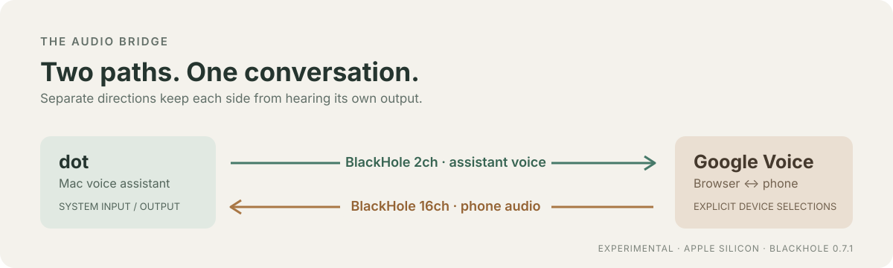
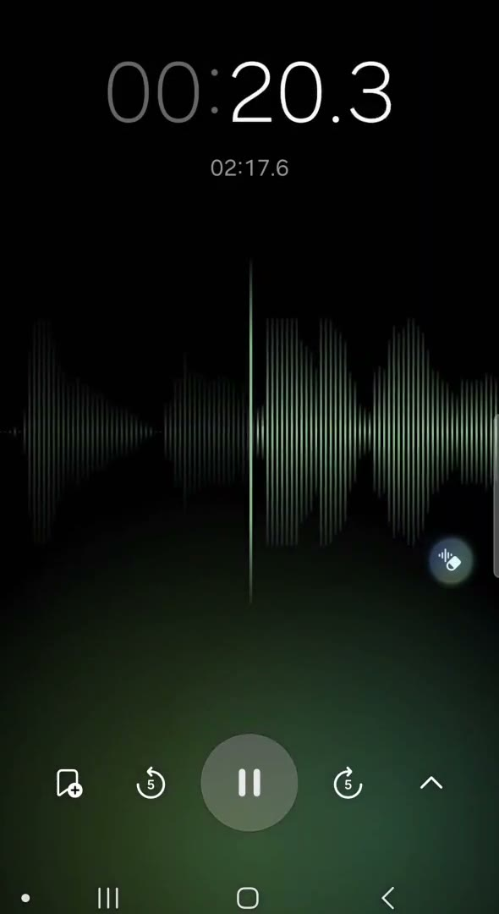
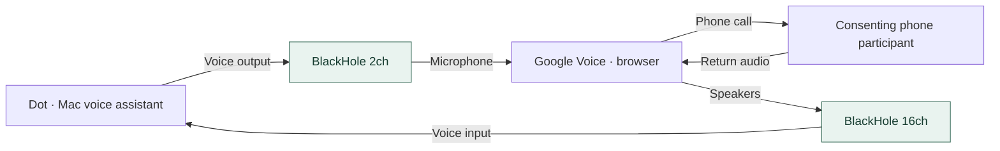

<h1 align="center">Mac Voice Bridge</h1>

<p align="center">
  <strong>A Mac voice assistant. A browser phone call. Two independent audio paths.</strong>
</p>

<p align="center">
  <a href="https://github.com/josusanmartin/mac-voice-bridge/actions/workflows/checks.yml"></a>
  &nbsp; · &nbsp; <a href="LICENSE">MIT licensed</a>
  &nbsp; · &nbsp; Experimental
</p>

<p align="center">
  <a href="#watch-the-demo">Watch the demo</a> &nbsp; / &nbsp;
  <a href="#quick-start">Get started</a> &nbsp; / &nbsp;
  <a href="#reusable-skill">Install the skill</a> &nbsp; / &nbsp;
  <a href="skills/mac-voice-bridge/references/troubleshooting.md">Troubleshoot</a>
</p>

<p align="center">
  
</p>

## Watch the demo

A 29-second excerpt from the experiment, with the original audio preserved. Click the preview to open the video, or [download the MP4](https://raw.githubusercontent.com/josusanmartin/mac-voice-bridge/main/assets/mac-voice-bridge-demo.mp4).

<p align="center">
  <a href="assets/mac-voice-bridge-demo.mp4">
    
  </a>
  <br>
  <a href="assets/mac-voice-bridge-demo.mp4"><strong>▶ Watch Mac Voice Bridge in action</strong></a>
  <br>
  <sub>29 seconds · MP4 with audio · caller header removed</sub>
</p>

## What this does

An experimental, two-way bridge between **dot**, the voice assistant in the Codex Mac app, and **Google Voice**, using two independent BlackHole virtual devices.

In one Apple Silicon Mac experiment on September 30, 2026, a person on the phone confirmed hearing dot, and dot heard the person through Google Voice. This project documents that route and packages a reusable skill to help others reproduce it.

> [!NOTE]
> **Single-environment proof of concept.** This is not an official OpenAI or Google integration. An operator manages the phone call; the assistant does not gain native dialing or call-attachment capabilities. Compatibility can change with software updates.

> [!IMPORTANT]
> **Hang up first. Restore audio second.** Confirm the phone call has ended before restoring devices. CoreAudio restoration does not end a call or stop billing. An early 65-second routing guard cut audio before hangup in the experiment.

## How the audio flows



| Setting | Bridge selection |
| --- | --- |
| macOS default sound output | BlackHole 2ch |
| macOS default sound input | BlackHole 16ch |
| Google Voice microphone | **Explicit** BlackHole 2ch |
| Google Voice speakers | **Explicit** BlackHole 16ch |
| Google Voice ringing | Separate physical output |
| macOS alert output | Built-in output, where supported |

The direction matters. Sharing one virtual bus in both directions mixes audio and can feed a service its own voice. Two mirrored names for one bus do not provide isolation. The first stereo pair of the 16-channel device was accepted in the observed setup; do not assume every app accepts that layout.

With these defaults, the Mac's physical microphone is no longer dot's input, and dot may no longer be audible through the Mac's speakers. **Other apps using the default output can also be sent to the phone.** Pause their playback and suppress notifications. Separate alert output reduces this risk but does not cover every app's sounds.

## What you need

- A Mac with a voice assistant that actually follows the selected system devices. The observed assistant was dot in the Codex Mac app.
- Both **BlackHole 2ch and BlackHole 16ch**, separately installed. Official version **0.7.1** was used in the experiment, at existing **48 kHz** rates. BlackHole binaries are not included here.
- A Google Voice account eligible to make calls, a browser, and microphone access for the relevant apps. Brave worked in this experiment; it is not one of the browsers listed on Google's current [supported-browser page](https://support.google.com/voice/answer/3379129). Use the vendor's supported choices when troubleshooting.
- Python 3.9+ for the optional helpers; their runtime uses only the standard library. No Audacity, PortAudio, Python audio package, token, or API key is required by these helpers.
- A consenting test participant or a phone endpoint you control; headphones if adding local monitoring.

## Quick start

### 1. Follow the replication guide

Read the [full replication procedure](skills/mac-voice-bridge/references/workflow.md) before changing devices. Its order is:

1. Run the offline checks, without a call or audio-device access.
2. Install and inspect the two drivers during a safe maintenance window.
3. Save the current macOS defaults and note the browser's current microphone, speaker, and ringing selections privately.
4. Test each unused virtual path with generated signals and local meters, one direction at a time.
5. Select the browser's explicit devices, then the Mac defaults; verify the assistant follows them.
6. Only with call authorization, participant consent, and cost approval, start a short supervised call.
7. Ask before normal hangup unless ending the call is already authorized. Hang up, verify the disconnected state, then restore and verify both macOS and browser selections.

### 2. Run the safe offline checks

From the repository root, these checks work on macOS, Linux, and Windows and do not play or capture audio:

```sh
python3 skills/mac-voice-bridge/scripts/offline_check.py
python3 -m unittest discover -s tests -v
```

### 3. Save your audio baseline

On macOS, the optional helper reads metadata and creates a private restoration baseline:

```sh
mkdir -p .runtime
python3 skills/mac-voice-bridge/scripts/audio_state.py inspect
python3 skills/mac-voice-bridge/scripts/audio_state.py snapshot .runtime/before.json
```

Keep this output local: device names and unique identifiers can be identifying. A snapshot refuses to overwrite an existing file and is created with owner-only permissions. Capture a fresh baseline before each session, using a new filename. It does not save browser selections, gains, sample rates, aggregate devices, or permissions.

### 4. Restore after hangup

Preview restoration at any time; apply it **after confirming phone hangup**:

```sh
python3 skills/mac-voice-bridge/scripts/audio_state.py restore .runtime/before.json
python3 skills/mac-voice-bridge/scripts/audio_state.py restore .runtime/before.json --apply --call-ended
```

`--call-ended` is an operator declaration, not a check of Google Voice. For immediate feedback recovery, `--apply --emergency` permits restoration before that declaration; manually hang up promptly. The helper never operates a browser, opens an audio stream, dials, hangs up, starts a watchdog, or changes routes automatically. If it fails or cannot see devices in a sandbox, use macOS Sound settings and your private notes. Restoration is verified by stable device UID, not a stale numeric device ID.

## What was verified

| Stage | Observed result | Scope |
| --- | --- | --- |
| Offline graph and fault controls | Separate routes passed; mixing, swapped routes, and silence rejected | Synthetic model only |
| Two installed devices | Independent 440/880 Hz stereo paths passed individually and together | Short real-device synthetic test; existing 48 kHz rates |
| Google Voice local speaker test | Reached BlackHole 16ch | Local app test, no phone needed |
| Google Voice microphone meter | Speech-like synthetic input on 2ch registered | Pure 440 Hz did not register; filtering remains a hypothesis |
| Dot input | Generated spoken phrase reached dot while the operator stayed silent | Attribution confirmed by operator |
| Real phone call | Person heard dot on the phone; dot heard the person | Supervised, consenting endpoint in one environment |
| Audio recovery | Original macOS defaults restored | Does not end a phone call |

No private audio recording was made by the experiment scripts. The demonstration above is a separately supplied excerpt approved for public sharing; its identifying header and source metadata were removed. Service audio processing and retention still apply. Raw transcripts, private device inventories, and original execution logs are not distributed. See [test evidence and limits](docs/testing.md).

## Privacy, consent, and cost

Explain to participants that an AI assistant will receive and produce call audio. Obtain their consent before connecting it. Check applicable recording and AI disclosure requirements for your use; this project provides no recording feature. Ordinary service processing and retention still apply. Avoid sensitive conversations while evaluating the bridge.

Check the exact destination rate and approve any charge before calling. The tested call announced **1 cent per minute**; this is an observation, not a general price. [Google's calling guidance](https://support.google.com/voice/answer/3379129) explains that charges vary. Neither muting, restoring devices, losing audio, nor closing the local helper confirms disconnection. Verify hangup in the phone service.

Use three separate timing concepts: a **setup timeout** for permissions and device checks; a **connected-call timer** started only when the phone call actually connects; and an optional **emergency routing deadline** that may cut audio but cannot end billing. Do not let a deadline measured from setup masquerade as a connected-call duration. See the [timing procedure](skills/mac-voice-bridge/references/workflow.md#timing-and-teardown).

## Reusable skill

The [mac-voice-bridge skill](skills/mac-voice-bridge/SKILL.md) packages the workflow and helpers for an agent that has local macOS access. It keeps installation, permission grants, routing changes, paid calls, and normal hangup within the user's authorized scope.

To install it for Codex, copy the complete skill directory into your configured skills directory. A typical default is:

```sh
mkdir -p "$HOME/.codex/skills"
cp -R skills/mac-voice-bridge "$HOME/.codex/skills/"
```

Check for an existing installation first; do not overwrite local customizations. Start a session that can discover the new skill and invoke `$mac-voice-bridge`. Copying the skill does not install drivers, grant permissions, place calls, or change audio settings. Installation into an agent's skills directory has not been performed by this project.

A skill is the useful first package: the work combines OS routing, browser controls, consent, and recovery. A browser extension cannot supply the two CoreAudio buses by itself. A Codex plugin could distribute this skill later, but a manifest adds no current audio capability, so this release does not include a plugin scaffold or an MCP service. See [architecture and next steps](docs/architecture.md).

## Explore the project

| Guide | Start here when you want to… |
| --- | --- |
| [Replication procedure](skills/mac-voice-bridge/references/workflow.md) | Install the drivers and reproduce each stage |
| [Troubleshooting](skills/mac-voice-bridge/references/troubleshooting.md) | Diagnose permissions, routing, feedback, or recovery |
| [Architecture](docs/architecture.md) | Understand the two-bus design and packaging choices |
| [Testing and limits](docs/testing.md) | See what was demonstrated and what remains untested |
| [Reusable skill](skills/mac-voice-bridge/SKILL.md) | Give a local agent the workflow and recovery helpers |

### Official sources

- [BlackHole official project and installation](https://github.com/ExistentialAudio/BlackHole)
- [Apple sound output settings](https://support.apple.com/guide/mac-help/change-the-sound-output-settings-mchlp2256/mac) and [sound input settings](https://support.apple.com/guide/mac-help/change-the-sound-input-settings-mchlp2567/mac)
- [Google Voice calls, supported browsers, and rates](https://support.google.com/voice/answer/3379129)

The MIT license covers this repository's guide, skill, and helpers. BlackHole and the services retain their own licenses and terms; their code and binaries are not redistributed. Contributions should include synthetic or anonymized observations only. Never attach a phone number, account identifier, device UID, private snapshot, recording, or call transcript to a public issue.
